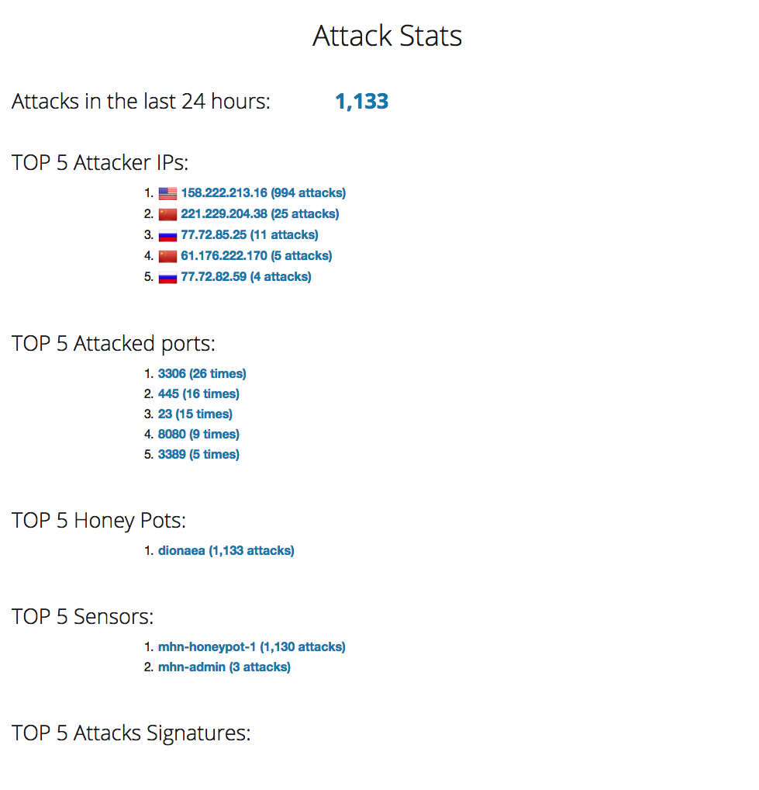

# codepath-week9

# honeypots deployed

Only the dionaea honeypot was deployed.

# issues

Some very minor setup issues, but mostly resulted in trying to run a command in the wrong terminal and then also not have enabled the API for billing properly.

I also accidentally attacked the admin server.

# unresolved questions

None.

# map of attacks

# summary of attacks
We see below a list of all the unique simulated attacks. Some of the attacks are localized to specific cities while other attacks are only recorded from the country as a whole. Some of the attacks were repeated from the same place at different times.

There were 1130 attacks done.

