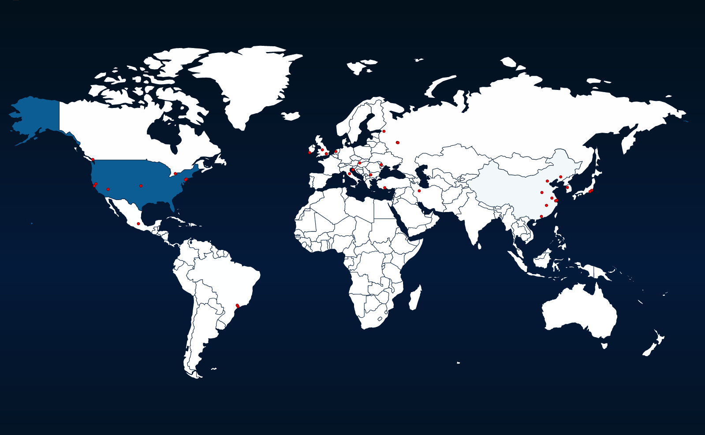

# codepath-week9

# honeypots deployed

Only the dionaea honeypot was deployed.

# issues

Some very minor setup issues, but mostly resulted in trying to run a command in the wrong terminal and then also not have enabled the API for billing properly.

# unresolved questions

None.

# map of attacks

# summary of attacks
We see below a list of all the unique simulated attacks. Some of the attacks are localized to specific cities while other attacks are only recorded from the country as a whole. Some of the attacks were repeated from the same place at different times.

13:49:47 <dionaea.connections> New attack from New York, USA (40.83, -73.95)
13:50:46 <dionaea.connections> New attack from Stoney Creek, Canada (43.22, -79.70)
13:51:25 <dionaea.connections> New attack from Sofia, Bulgaria (42.68, 23.32)
13:51:35 <dionaea.connections> New attack from Pula, Croatia (44.87, 13.85)
13:51:59 <dionaea.connections> New attack from Moscow, Russia (55.75, 37.62)
13:53:54 <dionaea.connections> New attack from Nanchang, China (28.55, 115.93)
13:54:55 <dionaea.connections> New attack from Richmond, Canada (49.16, -123.17)
13:55:23 <dionaea.connections> New attack from Jiaxing, China (30.75, 120.75)
13:55:58 <dionaea.connections> New attack from Shanghai, China (31.05, 121.40)
13:57:15 <dionaea.connections> New attack from Amsterdam, Netherlands (52.35, 4.92)
13:58:45 <dionaea.connections> New attack from United Kingdom (51.50, -0.12)
13:59:43 <dionaea.connections> New attack from Tokyo, Japan (35.69, 139.75)
14:00:20 <dionaea.connections> New attack from Edison, USA (40.50, -74.32)
14:01:10 <dionaea.connections> New attack from United Kingdom (51.50, -0.12)
14:01:58 <dionaea.connections> New attack from Amsterdam, Netherlands (52.35, 4.92)
14:02:31 <dionaea.connections> New attack from Shenyang, China (41.79, 123.43)
14:02:46 <dionaea.connections> New attack from Edison, USA (40.50, -74.32)
14:04:37 <dionaea.connections> New attack from Sacramento, USA (38.70, -121.56)
14:05:25 <dionaea.connections> New attack from Saint Petersburg, Russia (59.89, 30.26)
14:08:03 <dionaea.connections> New attack from USA (37.75, -97.82)
14:09:15 <dionaea.connections> New attack from Öttevény, Hungary (47.73, 17.48)
14:09:24 <dionaea.connections> New attack from Yeosu, South Korea (37.02, 126.96)
14:11:20 <dionaea.connections> New attack from Las Vegas, USA (36.17, -115.14)
14:11:47 <dionaea.connections> New attack from Moldova (47.02, 28.81)
14:12:40 <dionaea.connections> New attack from San Francisco, USA (37.74, -122.37)
14:12:41 <dionaea.connections> New attack from Sao Paulo, Brazil (-23.57, -46.64)
14:13:59 <dionaea.connections> New attack from Stoke-on-trent, United Kingdom (53.00, -2.18)
14:15:47 <dionaea.connections> New attack from Shenyang, China (41.79, 123.43)
14:17:48 <dionaea.connections> New attack from Italy (43.15, 12.11)
14:19:39 <dionaea.connections> New attack from Guangzhou, China (23.12, 113.25)
14:21:25 <dionaea.connections> New attack from Pula, Croatia (44.87, 13.85)
14:21:53 <dionaea.connections> New attack from Sofia, Bulgaria (42.68, 23.32)
14:22:22 <dionaea.connections> New attack from Antalya, Turkey (36.91, 30.70)
14:23:22 <dionaea.connections> New attack from Mexico, Mexico (19.44, -99.14)
14:24:02 <dionaea.connections> New attack from Numazu, Japan (35.10, 138.87)
14:24:04 <dionaea.connections> New attack from Sofia, Bulgaria (42.68, 23.32)
14:24:27 <dionaea.connections> New attack from Las Vegas, USA (36.17, -115.14)
14:24:40 <dionaea.connections> New attack from Nanjing, China (32.06, 118.78)
14:28:36 <dionaea.connections> New attack from Campinas, Brazil (-22.91, -47.07)
14:29:11 <dionaea.connections> New attack from Upper Norwood, United Kingdom (51.42, -0.08)
14:29:19 <dionaea.connections> New attack from Las Vegas, USA (36.17, -115.14)
14:31:33 <dionaea.connections> New attack from Macroom, Ireland (51.90, -8.95)
14:32:29 <dionaea.connections> New attack from Iran (35.46, 48.88)
14:32:32 <dionaea.connections> New attack from Russia (55.74, 37.61)
14:32:55 <dionaea.connections> New attack from Zhengzhou, China (34.68, 113.53)

